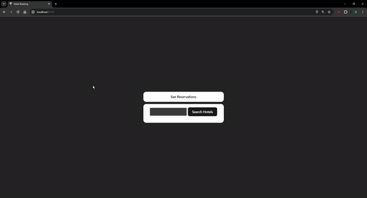

# How to run project

### Backend:
- change the url, username and password in application.properties for the database
- run with hibernate.ddl-auto = create
- populate database (see postman collection)
- run application

### Frontend:
- npm install
- npm run dev

# Hotel Booking Demo Video

